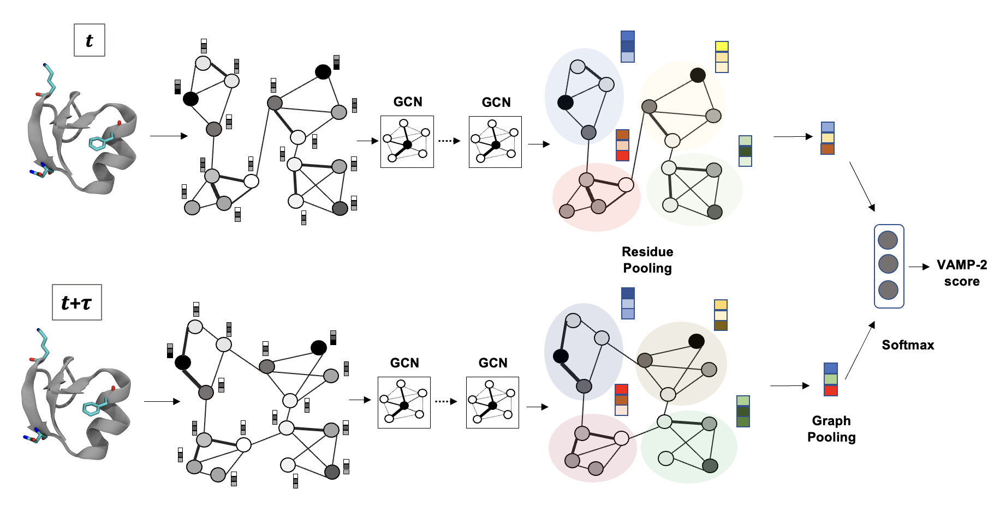

# GraphVampNet



This repo contains the code for **GraphVAMPNet**


## GraphVAMPNet code

## Usage

### training
```
python train.py --epochs 100 --batch-size 1000 --lr 0.0005 --hidden 16  
    --num-atoms 20 --num-classes 5 --num_neighbors 7 --conv_type SchNet --dmin 0 
    --dmax 8. --step 0.5 --dist-data dists.dat --nbr-data nbrs.dat --residual  --train
```
### testing

```
python train.py --epochs 100 --batch-size 1000 --lr 0.0005 --hidden 16 
    --num-atoms 20 --num-classes 5 --num-neighbors 7 --conv_type SchNet --dmin 0
    --dmax 8. --step 0.5 --dist-data dists.dat --nbr-data nbrs.dat --residual --trained-model
    logs/logs_99.pt
```

## Requirements
- pytorch
- deeptime
- torch_scatter


## Sources:
- VAMPNet code is based on deeptime package [deeptime](https://deeptime-ml.github.io/latest/index.html)
- SchNet code is based on the [cgnet](https://github.com/brookehus/cgnet)


## Cite
If you use this code please cite the following paper:

```
```
